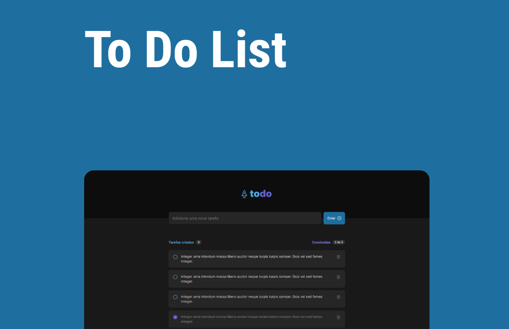
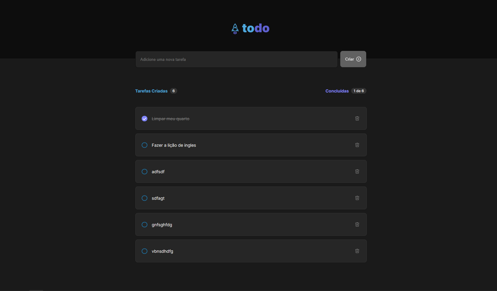
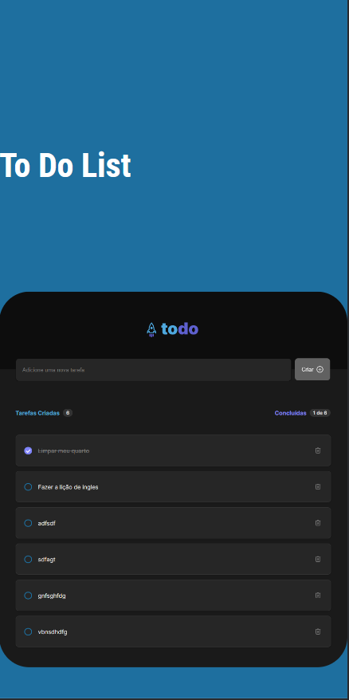
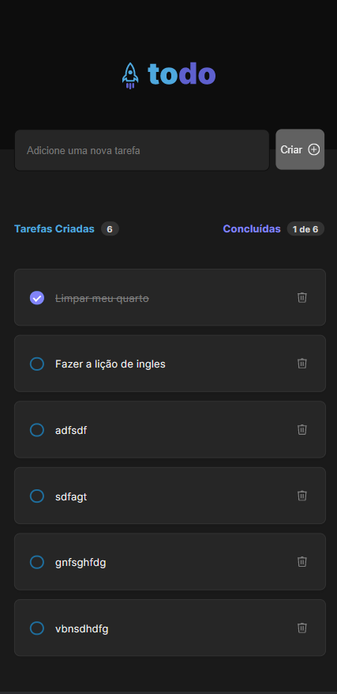

# ToDo List

 

# Tela Mobile
 

    
    

 

# Sobre o projeto 
 
https://todolist-renan-montano.netlify.app/
 
ToDo List é uma aplicação FRONT-END em React construída como atividade mensal da faculdade.
A aplicação consiste em uma Home e uma lista de tarefas, onde é possível adicionar uma tarefa, remover e editar como concluída.

# Tecnologias utilizadas
Front end
HTML / CSS / TypeScript
ReactJS
VITE
Front end web: Netlify
Back end Api: render.com

# clonar repositório
git clone https://github.com/renanmontanopaz/React-ToDo

# executar o projeto
Front end web 
Pré-requisitos: npm / yarn 


# entrar na pasta do projeto front end web

# instalar dependências
yarn install | npm run install

# executar o projeto
npm run dev

# Autor 
Renan Montano Paz
https://www.linkedin.com/in/renan-montano-paz-b0109855/
## Disponível nas plataformas

Computer Version:

## Tecnologias utilizadas:

## Sites utilizados:

## IDES utilizadas:

